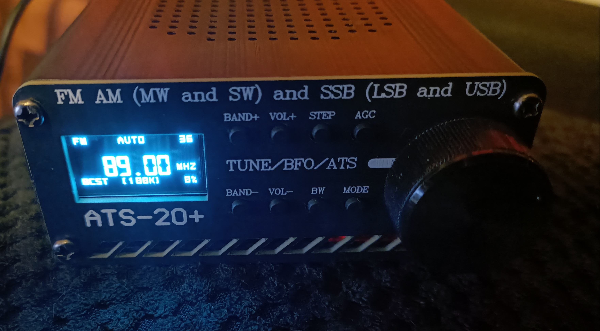
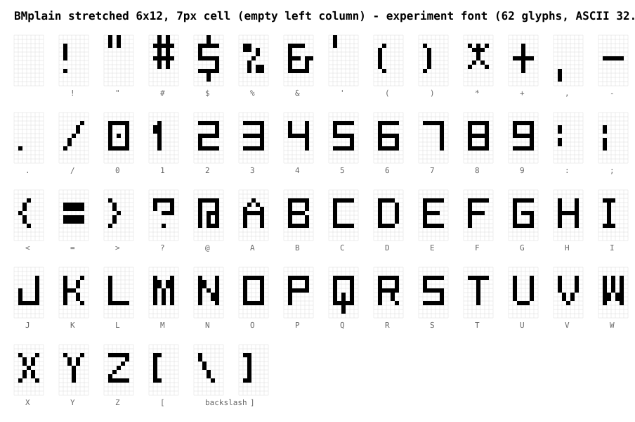

# Ophis Firmware for ATS-20 DSP Receiver

Ophis is an open-source firmware for the **ATS-20 / ATS-20+** DSP receiver
(Arduino Nano / ATmega328P + Si473x chip + 128x64 OLED). It was based on
**ATS_EX by Goshante**, which is itself based on the **PU2CLR SI4735** firmware by
Ricardo Caratti and inspired by the (closed-source) swling.ru firmware.

**A full illustrated user manual is here: [USER_MANUAL.md](USER_MANUAL.md).**

<p align="center">
    
</p>

## Changes compared to Goshante's ATS_EX

### Radio features and UI

- **Experimental airband** (`AIR`): 118–136.975 MHz AM reception using an
  out-of-spec 5th-harmonic mode of the Si473x — the chip is tuned to a fifth
  of the displayed frequency. AM-only; reception quality varies between units.
- **Band-mode availability matrix**: which modulations each band supports is a
  single declarative table; the stored mode is validated against it on boot
  (protects against corrupt EEPROM), and while the band-selection command is
  active the display shows the **next available mode**.
- **Numbered SW sub-bands** (`SW1`–`SW19`): the band tag always shows the
  shortwave segment the frequency is in, and band selection offers every
  segment as an individual browse stop.
- **Reworked band selection**: browsing with the encoder changes only the
  selection — the radio keeps playing until you exit (encoder button, BAND+,
  or ~3 s of inactivity). Long-pressing BAND+/BAND− still switches bands
  immediately, hopping through the SW segments.
- **Direct frequency entry**: hold the encoder button to type a frequency
  digit by digit (rotate = digit, press = next, 5 s timeout cancels).
- **Settings as one scrolling list** instead of paged menus; BAND+ jumps to
  the top of the list instead of switching pages.
- **Redesigned status lines**: the band tag sits at the bottom left in every
  state (the FM band now has a tag, `BCST`, broadcast), the tuning step is shown in
  brackets (`[9K]`), and the battery percentage sits at the bottom right.
- **New compact UI font** derived from TinyOLED-Fonts' BMplain (6×12 glyphs
  in 7-px cells); all interface text and RDS names render uppercase.
  Goshante's 8×16 Pixel Operator font remains in the tree as an alternative.

<p align="center">
    
</p>

- **Battery display works on the ATS-20+ out of the box** — the factory
  voltage divider (pin A1) is auto-detected at power-on. The original ATS-20
  still needs the divider mod (see the manual).
- **Faster EEPROM auto-save**: settings are stored 3 s after the last change
  (was 10 s).
- **Rebranded** to Ophis (v1.0); splash reads "OPHIS ATS 20".
- **Bugfixes and hardening**: undefined behavior removed from the button,
  EEPROM and RDS paths; faster tuning response; stale RDS text no longer
  remains on screen when leaving the FM band; a 16-bit overflow in the
  airband frequency display fixed; remaining compiler warnings silenced.

### Under the hood

- **Minimal TWI master**: the stock Arduino Wire library is replaced by
  `lib/WireShim`, a small polling I2C master with bus timeouts — about 2 KB
  of flash and 100 B of RAM smaller. Both build environments use it.
- **Modular source layout**: the monolithic ~1900-line `main.cpp` is split
  into focused modules (tuner, UI, settings, EEPROM, direct entry, fonts).
- **Size work**: dead code removed, duplicated logic merged — several hundred
  bytes reclaimed to make the features above fit.

## Build

The project builds with [PlatformIO](https://platformio.org/) — no Arduino IDE
needed; toolchain, framework and libraries are fetched automatically.

```bash
pip install -U platformio     # once (or: pipx install platformio)
pio run                       # build the firmware (default env)
pio run -t upload             # flash it over USB
pio run -t clean              # clean build artifacts
```

There are two build environments, both using the minimal WireShim TWI master:

| Env | Board |
|---|---|
| **`nano_twi`** (default) | Arduino Nano, ATmega328P, **new** bootloader (e.g. ATS-20+) |
| **`nano_twi_old`** | Arduino Nano, ATmega328P, **old** bootloader (most ATS-20 units) |

`pio run` builds `nano_twi`; add `-e nano_twi_old` to build or upload for the
other one. The `.hex` file lands at `.pio/build/<env>/firmware.hex` and can be
flashed with any AVRDUDE-based tool (e.g. AVRDUDESS on Windows: preset
"Arduino Nano (ATmega328P)", tick **Old Bootloader** for `nano_twi_old`, select
your COM port, write the hex). If flashing fails, use a USB port that supplies
more current (USB 3.0) and try again.

## Checking the firmware size

The ATmega328P has 30,720 bytes of flash and 2,048 bytes of RAM; the firmware
runs close to both limits, so every change should be size-checked. `pio run`
prints the usage after linking:

```
RAM:   [=====     ]  52.4% (used 1074 bytes from 2048 bytes)
Flash: [========== ]  97.2% (used 29874 bytes from 30720 bytes)
```

For a per-symbol breakdown (which function/constant costs what), use the
toolchain's `avr-nm` on the linked ELF:

```bash
~/.platformio/packages/toolchain-atmelavr/bin/avr-size \
    .pio/build/nano_twi/firmware.elf          # section sizes (.text = flash)

~/.platformio/packages/toolchain-atmelavr/bin/avr-nm -S -C --size-sort -t d \
    .pio/build/nano_twi/firmware.elf          # every symbol with its size
```

Keep in mind the build uses LTO and `-ffunction-sections`, so sizes only
materialize in the linked ELF — per-object-file sizes before linking are
meaningless.

## Credits

- **Goshante** — original [ATS_EX](https://github.com/goshante/ats20_ats_ex) firmware
- **Ricardo Caratti (PU2CLR)** — [SI4735 library](https://github.com/pu2clr/SI4735)
- **Stephen Denne (datacute)** — Tiny4kOLED and TinyOLED-Fonts (source of the
  BMplain UI font)
- **Jayvee Enaguas (HarvettFox96)** — Pixel Operator font (CC0), the
  alternate 8×16 UI font
- See `LICENCE` for license information.
