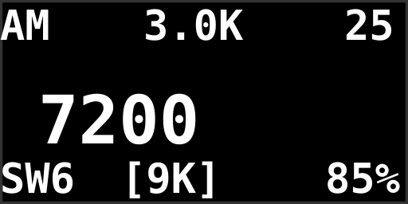
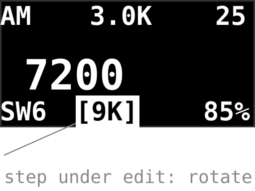
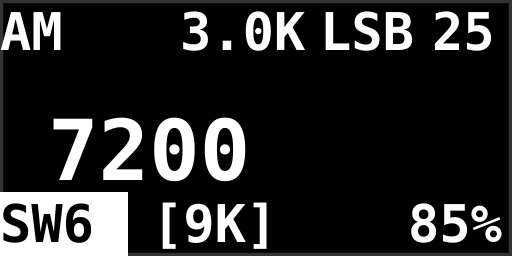
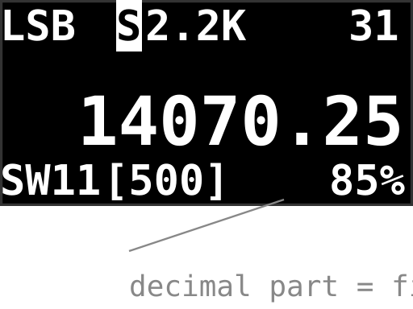
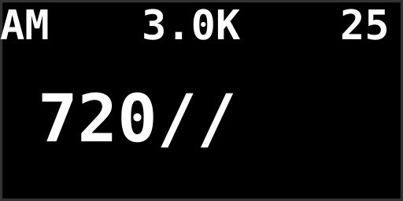
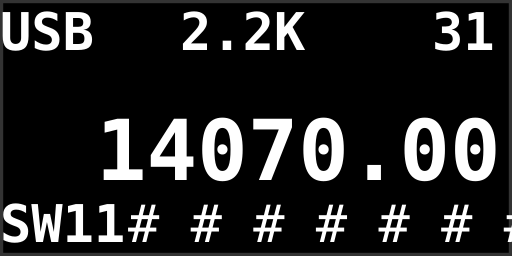
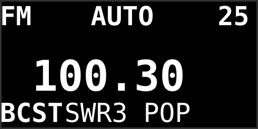
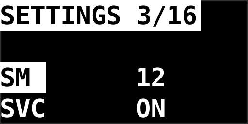

# Ophis Firmware — User Manual

A practical guide to using the Ophis firmware on an ATS-20 / ATS-20+ receiver.
For build and flash instructions see the [README](README.md).

## Quick start

1. Flash the firmware (see README).
2. **Reset the settings once**: hold the **encoder button** while powering the
   receiver on, until `EEPROM RESET` appears. Your settings, per-band
   frequencies, steps and bandwidths are then stored to EEPROM automatically
   (about 3 seconds after each change).

## The display

The screen has three zones: a status line on top, the large frequency readout
in the middle, and a status line at the bottom.

| # | Element | Meaning |
|---|---|---|
| 1 | `AM` / `LSB` / `USB` / `CW` / `FM` | Current modulation mode |
| 2 | `S` (right of the mode) | SSB Sync is active |
| 3 | `3.0K` / `AUTO` | Bandwidth (per mode; hidden in CW) |
| 4 | `25` | Volume (shows `M` when muted) |
| 5 | Large digits | Frequency. In SSB the fractional part after the digits is the fine BFO part |
| 6 | `LW` `MW` `SW1`–`SW19` `AIR` `BCST` | Band tag (bottom left, always visible) |
| 7 | `[9K]` | Tuning step (no suffix = Hz, e.g. `500` = 500 Hz) |
| 8 | `85%` | Battery charge (built-in on ATS-20+; mod needed on the original ATS-20) |

## Buttons

| Button | Short press | Hold / long press |
|---|---|---|
| **BAND+** | Enter band selection | Scroll bands forward |
| **BAND-** | Open/close settings (closing saves) | Scroll bands backward |
| **VOL+** | Volume adjustment mode | Volume up |
| **VOL-** | Mute / unmute | Volume down |
| **BW** | Bandwidth adjustment mode | — |
| **STEP** | Step adjustment mode | S-meter on/off |
| **AGC** | Display on/off | SSB Sync (SSB only) |
| **MODE** | Cycle AM → LSB → USB → CW (FM band: RDS on/off) | — |
| **Encoder** | Confirm / seek / RDS info cycle | **Direct frequency entry** |

**Power-on with the encoder button held**: EEPROM reset.

## The bands

| Tag | Range | What it is | What you'll hear |
|---|---|---|---|
| `LW` | 153–520 kHz | Longwave | AM broadcast (mainly Europe/Asia), navigation beacons |
| `MW` | 520–1710 kHz | Medium wave | The classic AM broadcast band |
| `SW1`–`SW19` | 1711–30000 kHz | Shortwave, 19 numbered segments | World-band radio, amateur radio, CB |
| `AIR` | 118–136.975 MHz | Aviation airband | Air traffic control, AM only (experimental; quality varies between units) |
| `BCST` | 64–108 MHz | FM broadcast | FM radio stations, RDS |

Each band supports a fixed set of modulation modes:

| Band | Modes |
|---|---|
| LW, MW, SW | AM, LSB, USB, CW |
| AIR | AM only |
| BCST (FM) | FM broadcast only |

## The SW sub-bands

Shortwave is one continuous 1711–30000 kHz range divided into 19 numbered
segments. The tag always shows which segment (`SW1`…`SW19`) your frequency
sits in:

| # | Start | Band | # | Start | Band |
|---|---|---|---|---|---|
| SW1 | 1711 kHz | 160 m | SW11 | 14000 kHz | 20 m (ham) |
| SW2 | 3500 kHz | 80 m (ham) | SW12 | 15000 kHz | 19 m |
| SW3 | 4500 kHz | 90 m | SW13 | 17200 kHz | 16 m |
| SW4 | 5600 kHz | 75 m | SW14 | 18000 kHz | 17 m |
| SW5 | 6800 kHz | 40 m (ham) | SW15 | 21000 kHz | 15 m (ham) |
| SW6 | 7200 kHz | 41 m | SW16 | 21400 kHz | 13 m |
| SW7 | 8500 kHz | 33 m | SW17 | 24890 kHz | 12 m (ham) |
| SW8 | 10000 kHz | 30 m (ham) | SW18 | 26200 kHz | CB (11 m) |
| SW9 | 11200 kHz | 25 m | SW19 | 28000 kHz | 10 m (ham) |
| SW10 | 13400 kHz | 22 m | | | |

Segments are hop targets and labels, not limits — the tuner never stops at a
segment boundary; you can tune continuously across the whole SW range.

## Modes and how to switch them

Press **MODE** to cycle through the modes available on the current band:
AM → LSB → USB → CW → AM (LW/MW/SW). On the FM band the MODE button toggles
the RDS line instead, and on the airband it does nothing — those bands are
mode-locked. While the band-selection highlight is active, the **next mode**
is shown on the top line so you know what MODE will switch to.

## Tuning

- **Encoder rotation** tunes by the step shown at the bottom (`[9K]` = 9 kHz;
  no suffix means Hz). Steps: AM 1/5/9/10/50/100/1000 kHz, SSB adds fine
  10/25/50/100/500 Hz steps, FM 50/100/1000 kHz. Short-press **STEP** (or the
  encoder button when `SCA` is off) to change it.
- Tuning past the band edge wraps around to the other end.
- **Direct entry**: hold the encoder button, type the frequency digit by
  digit (rotate = digit, press = next), see "Direct frequency entry" below.
- **Station seek** (FM/AM): press the encoder button when `SCA` is on; rotate
  or press again to stop.

## Changing band

Short-press **BAND+** to enter band selection. The band tag at the bottom
left is **highlighted** and shows the stop you are browsing to, while the
**next modulation mode** appears on the top line so you can see what MODE
will switch to on that band:

The tag highlights and the whole stop list — LW, MW, SW1…SW19, AIR, BCST —
is browsed with the encoder:

- Rotating changes **only the selection**; the radio keeps playing the
  current band and the frequency display is untouched.
- A fast spin moves several stops at once.
- The switch happens when you **exit**: press the encoder button (confirm),
  press BAND+ again, or wait ~3 seconds. Exiting where you started changes
  nothing. Landing on `SWk` parks the radio on that segment's start
  frequency.
- Long-pressing **BAND+/BAND−** (without entering the selection) scrolls
  bands immediately, hopping through SW sub-bands as it goes — the fast way
  to flip through segments while listening.

## Using SSB (and CW)

SSB is where this firmware differs most from a stock radio. The screen in
SSB mode — mode + Sync marker on the top line, and the merged BFO as the
decimal part of the frequency:

1. **Enter SSB**: on LW/MW/SW press **MODE** until `LSB` or `USB` appears.
   The Si4735's SSB patch loads automatically (a second of silence is normal).
2. **Which sideband**: convention is LSB **below** 10 MHz and USB **above**
   — ham operators will tell you which one a given band uses. Switch with
   MODE; the `CW` setting in the menu chooses which sideband CW uses.
3. **Tuning**: the BFO is merged into the main frequency. Just tune until
   the voice sounds natural — there is no separate BFO knob. The decimal
   part of the frequency display is the fine BFO position. Use the fine
   steps (down to 10 Hz, via STEP) to zero in; tuning past ±16 kHz rolls
   into the main frequency seamlessly.
4. **Fine adjustments** in the settings menu:
   - `BFO` — permanent calibration (±0.6 kHz) if your radio's SSB is
     consistently off-frequency.
   - `SYN` (or long-press **AGC**) — Sync mode, locks onto the carrier for
     a cleaner, drift-free signal.
   - `COF` — cutoff filter; `AUT` engages it automatically for narrow
     bandwidths to suppress the unwanted sideband.
5. **CW (Morse)**: switch to CW with MODE; it uses the sideband chosen by
   the `CW` setting. Bandwidth adjustment is disabled in CW.
6. **Leaving SSB**: cycle MODE back to AM, or switch bands — the patch
   state is handled for you.

## Direct frequency entry

**Hold the encoder button** (in normal radio mode) to type a frequency
digit by digit. Unentered positions show as `/`:

- **Rotate** to change the current digit (0–9, wraps).
- **Press** the encoder to confirm the digit and move to the next one.
- Confirming the **last** digit applies the frequency.
- A second **long press** or 5 seconds without input cancels — nothing is
  tuned.

Digits per band: LW/MW 4 (kHz), SW 5 (kHz), AIR 6 (real kHz — the radio
converts internally), BCST 5 (`08750` = 87.50 MHz). Out-of-range values are
clamped to the band limits. In SSB, entering a frequency resets the BFO to 0.

## S-meter and RDS

- **Long-press STEP** toggles the S-meter: a 12-bar signal level scale at the
  bottom, right of the band tag:

- On the FM band, **MODE** toggles the RDS line: the station's name or
  program text replaces the step display. Press the **encoder button** while
  RDS is shown to cycle Station Name → Station Information → Program Info:

RDS needs a reasonably strong station; if no text appears, move off and back
onto the frequency so the chip re-synchronizes.

## Settings menu

Short-press **BAND-** to open. Three settings are visible at a time; rotate
the encoder to scroll the list, press to edit, rotate to change, press again
to save. The title shows the selected item's position. BAND+ jumps back to
the top of the list; BAND- closes and saves everything to EEPROM.

| Setting | Meaning |
|---|---|
| `ATT` | Attenuation; `AUT` = automatic gain control |
| `SM` | Soft mute (0–32) |
| `SVC` | AVC for SSB on/off |
| `SYN` | SSB Sync on/off (also: long-press AGC in SSB) |
| `DEE` | FM DeEmphasis, 50 or 75 µs |
| `AVC` | Automatic volume control (12–90) |
| `SCR` | Screen brightness (5–125) |
| `SW` | SW frequency units: KHZ or MHZ |
| `SSM` | SSB soft mute: RSSI- or SNR-based |
| `COF` | SSB cutoff filter: AUT / ON / OFF |
| `CPU` | CPU clock 100% / 50% (power saving) |
| `RDS` | RDS decode error threshold (0–3) |
| `BFO` | Permanent SSB BFO calibration (−60…60, 10 Hz units) |
| `UNI` | Show/hide frequency units |
| `SCA` | Encoder button = station seek (on) or step mode (off) |
| `CW` | CW sideband: LSB or USB |

## Battery indicator

The **ATS-20+** shows the battery percentage out of the box (the factory
divider is wired to pin A1, which the firmware reads).

The **original ATS-20** needs the hardware mod: solder a 10 kΩ + 10 kΩ
voltage divider between battery + and ground, connect the midpoint to pin
**A2**, and build the firmware with `BATTERY_VOLTAGE_PIN` set to `A2`.
